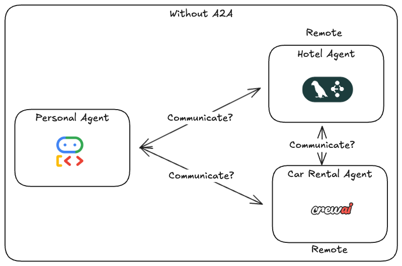
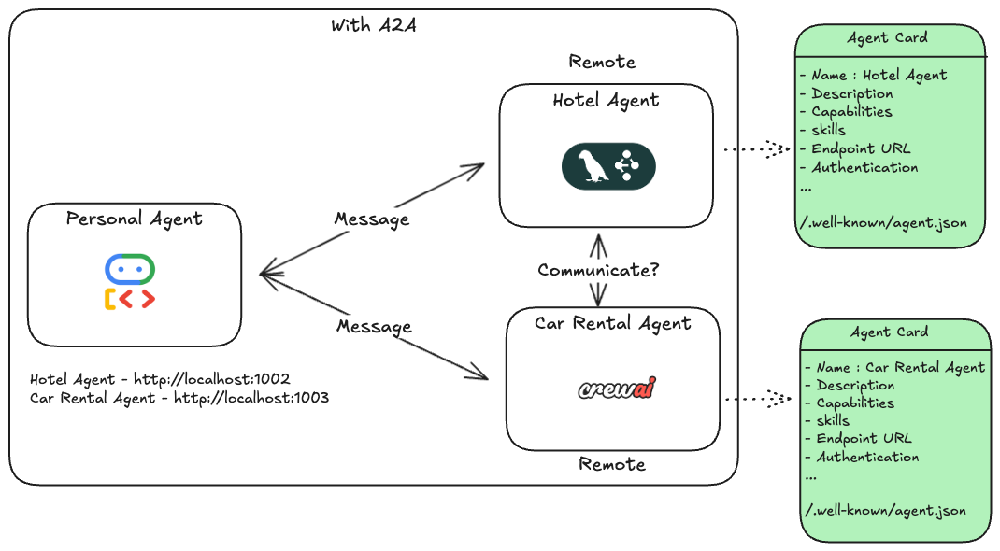
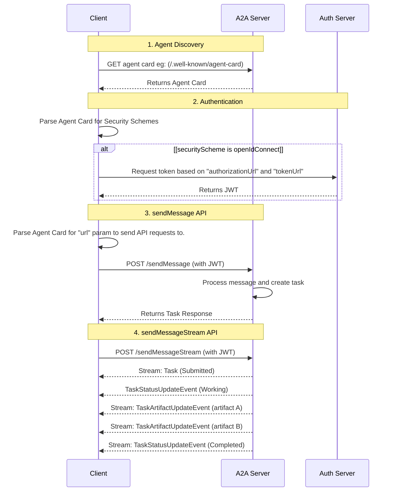

# Agent 2 Agent (A2A) Protocol


## Why do we need A2A protocol?

Consider an example where we have a personal agent which is used to book hotel and rental cars for our vacation trips. Each agent is built using different Agent frameworks and exposes a set of functionalities.



Common problems that need to be considered

- We need a way for the personal agent to communicate with the other 2 agents
- What are the features exposed by the hotel and car rental agents?
- What information should the personal agent send (text, image, video etc.) and the format?
- What kind of response do we get (JSON, text, Task etc.)?


## A2A protocol to the rescue

The Agent2Agent (A2A) Protocol is an open standard designed to facilitate communication and interoperability between independent, potentially opaque AI agent systems. In an ecosystem where agents might be built using different frameworks, languages, or by different vendors, A2A provides a common language and interaction model.

## Components

- A2A Client: An application or agent that initiates requests to an A2A Server on behalf of a user or another system.
- A2A Server (Remote Agent): An agent or agentic system that exposes an A2A-compliant HTTP endpoint, processing tasks and providing responses.
- Agent Card: A JSON metadata document published by an A2A Server, describing its identity, capabilities, skills, service endpoint, and authentication requirements.
- Task: The fundamental unit of work managed by A2A, identified by a unique ID. Tasks are stateful and progress through a defined lifecycle.
- Message: A communication turn within a Task, having a role ("user" or "agent") and containing one or more Parts.
- Part: The smallest unit of content within a Message or Artifact (e.g., TextPart, FilePart, DataPart).
- Artifact: An output (e.g., a document, image, structured data) generated by the agent as a result of a task, composed of Parts.
- Streaming (SSE): Real-time, incremental updates for tasks (status changes, artifact chunks) delivered via Server-Sent Events.
- Push Notifications: Asynchronous task updates delivered via server-initiated HTTP POST requests to a client-provided webhook URL, for long-running or disconnected scenarios.
- Session: An optional, client-generated identifier to logically group related tasks.

[A2A Protocol Specification](excalidraw/a2a-spec.excalidraw)

## Key Goals of A2A

- Interoperability: Bridge the communication gap between disparate agentic systems.
- Collaboration: Enable agents to delegate tasks, exchange context, and work together on complex user requests.
- Discovery: Allow agents to dynamically find and understand the capabilities of other agents.
- Flexibility: Support various interaction modes including synchronous request/response, streaming for real-time updates, and asynchronous push notifications for long-running tasks.
- Security: Facilitate secure communication patterns suitable for enterprise environments, relying on standard web security practices.
- Asynchronicity: Natively support long-running tasks and interactions that may involve human-in-the-loop scenarios.


## Guiding Principles

- Simple: Reuse existing, well-understood standards (HTTP, JSON-RPC 2.0, Server-Sent Events).
- Enterprise Ready: Address authentication, authorization, security, privacy, tracing, and monitoring by aligning with established enterprise practices.
- Async First: Designed for (potentially very) long-running tasks and human-in-the-loop interactions.
- Modality Agnostic: Support exchange of diverse content types including text, audio/video (via file references), structured data/forms, and potentially embedded UI components (e.g., iframes referenced in parts).
- Opaque Execution: Agents collaborate based on declared capabilities and exchanged information, without needing to share their internal thoughts, plans, or tool implementations.


## Personal Agent with A2A

Let's map the components of A2A with the above personal agent example.



- What are the features exposed? is resolved by the implementation of **Agent Card**
```Java
/**
 * The AgentCard is a self-describing manifest for an agent. It provides essential
 * metadata including the agent's identity, capabilities, skills, supported
 * communication methods, and security requirements.
 */
export interface AgentCard {
  /**
   * The version of the A2A protocol this agent supports.
   * @default "0.2.6"
   */
  protocolVersion: string;
  /**
   * A human-readable name for the agent.
   *
   * @TJS-examples ["Recipe Agent"]
   */
  name: string;
  /**
   * A human-readable description of the agent, assisting users and other agents
   * in understanding its purpose.
   *
   * @TJS-examples ["Agent that helps users with recipes and cooking."]
   */
  description: string;
  /** The preferred endpoint URL for interacting with the agent. */
  url: string;
  /**
   * The transport protocol for the preferred endpoint. Defaults to 'JSONRPC' if not specified.
   */
  preferredTransport?: string;
  /**
   * A list of additional supported interfaces (transport and URL combinations).
   * A client can use any of these to communicate with the agent.
   */
  additionalInterfaces?: AgentInterface[];
  /** An optional URL to an icon for the agent. */
  iconUrl?: string;
  /** Information about the agent's service provider. */
  provider?: AgentProvider;
  /**
   * The agent's own version number. The format is defined by the provider.
   *
   * @TJS-examples ["1.0.0"]
   */
  version: string;
  /** An optional URL to the agent's documentation. */
  documentationUrl?: string;
  /** A declaration of optional capabilities supported by the agent. */
  capabilities: AgentCapabilities;
  /**
   * A declaration of the security schemes available to authorize requests. The key is the
   * scheme name. Follows the OpenAPI 3.0 Security Scheme Object.
   */
  securitySchemes?: { [scheme: string]: SecurityScheme };
  /**
   * A list of security requirement objects that apply to all agent interactions. Each object
   * lists security schemes that can be used. Follows the OpenAPI 3.0 Security Requirement Object.
   */
  security?: { [scheme: string]: string[] }[];
  /**
   * Default set of supported input MIME types for all skills, which can be
   * overridden on a per-skill basis.
   */
  defaultInputModes: string[];
  /**
   * Default set of supported output MIME types for all skills, which can be
   * overridden on a per-skill basis.
   */
  defaultOutputModes: string[];
  /** The set of skills, or distinct capabilities, that the agent can perform. */
  skills: AgentSkill[];
  /**
   * If true, the agent can provide an extended agent card with additional details
   * to authenticated users. Defaults to false.
   */
  supportsAuthenticatedExtendedCard?: boolean;
}
```
- What are the inputs/outputs and the format? is resolved by the **Messages**

```python
# Message
{
    role: "user",
    parts: [{"type": "text", "text": "...."}]
    messageId: "1234"
    taskId: "ABCD"
    contextId: "XYZ"
}

# SendMessageSuccessResponse

{
    id: str|int,
    result: Message|Task
}

# Response as Message

{
    role: "user",
    parts: [{"type": "text", "text": "...."}]
    messageId: "1234"
    taskId: "ABCD"
    contextId: "XYZ"
}

# Response as Task

{
    id: "...",
    artifacts: list[Artifact],
    contextId: "XYZ",
    status: {
        message: "....",
        state: Completed|InProgress|submitted|cancelled
    }
}
```

- Execution is addressed using Agent Executor
```python
class SampleAgentExecutor(AgentExecutor):

    def __init__(self):
        self.agent = SampleAgent()

    def execute(self, request, task_id, context_id, ...):
        TODO 

    def cancel(self, request, task_id, context_id, ...):
        TODO 
```

## A2A Request Lifecycle



## Steps to create an A2A Server and client

### Server

1. Create the skills using **AgentSkill** class provided by A2A python library
```python
    skill = AgentSkill(
        id="hello_world",
        name="Greet",
        description="Return a greeting",
        tags=["greeting", "hello", "world"],
        examples=["Hey", "Hello", "Hi"],
    )
```
2. Create the agent card using **AgentCard** class provided by A2A python library
    - Dependency
        - Skill
        - Capability
```python
    agent_card = AgentCard(
        name="Greeting Agent",
        description="A simple agent that returns a greeting",
        url="http://localhost:9999/",
        defaultInputModes=["text"],
        defaultOutputModes=["text"],
        skills=[skill],
        version="1.0.0",
        capabilities=AgentCapabilities(),
```
3. Create a Request handler using **DefaultRequestHandler** class provided by A2A python library
    - Dependency
        - Agent Executor which is wrapper on top of agents built using any framework (LangGraph, ADK, CrewAI etc.)
    - Storage for the task
```python
    request_handler = DefaultRequestHandler(
        agent_executor=GreetingAgentExecutor(),
        task_store=InMemoryTaskStore(),
    )
```
4. Create a server application using **A2AStarletteApplication** class provided by A2A python library
```python
    server = A2AStarletteApplication(
        http_handler=request_handler,
        agent_card=agent_card,
    )
```
5. Run the server using **uvicorn.run()**
```python
    uvicorn.run(server.build(), host="0.0.0.0", port=9999)
```

### Agent Executor

```python
class GreetingAgentExecutor(AgentExecutor):
    def __init__(self):
        self.agent = GreetingAgent()

    async def execute(self, context: RequestContext, event_queue: EventQueue):
        # TODO
    async def cancel(self, context: RequestContext, event_queue: EventQueue):
        # TODO
```

### Client

1. Retrieve the agent card using **A2ACardResolver** class provided by the A2A client python library
2. Create an A2A client using **A2AClient** class provided by A2A client python library
3. Create a message
4. Send a request using **sendMessage** method provided by the A2AClient class
5. Process the response which is either a message or a Task


## References

- [Agent Card Discovery](https://a2a-protocol.org/latest/topics/agent-discovery/)
- [A2A Specification](https://a2a-protocol.org/latest/specification/)
- [A2A Overview by Holt S](https://www.linkedin.com/posts/holt_tedlasso-agent2agent-generativeai-activity-7336822761035575297-oWgD/)
- [Agent Registry](https://www.credal.ai/products/agent-registry)