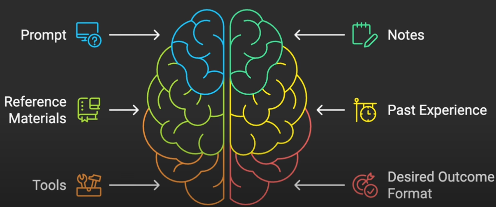
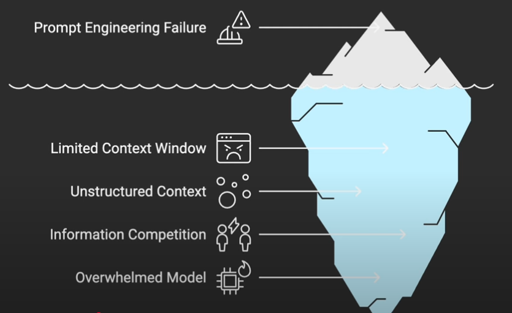
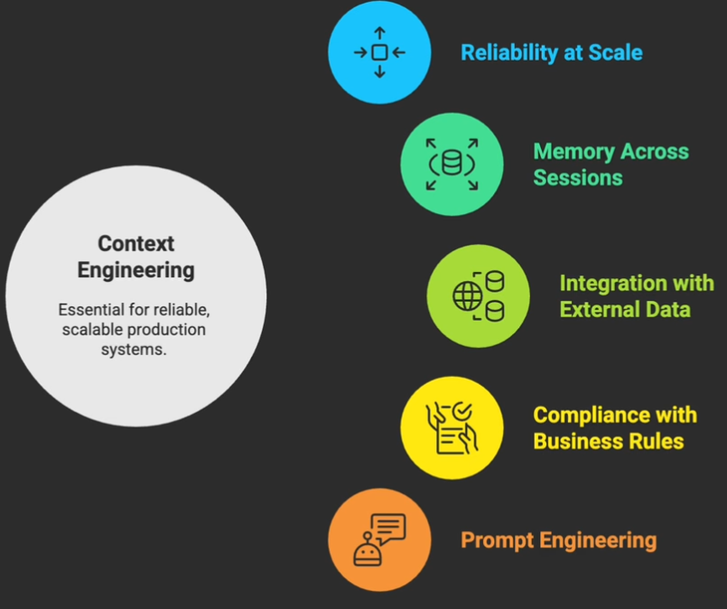
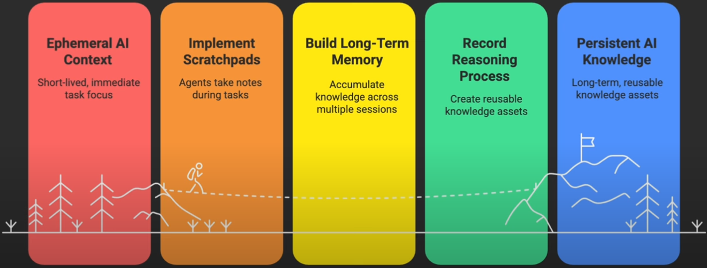
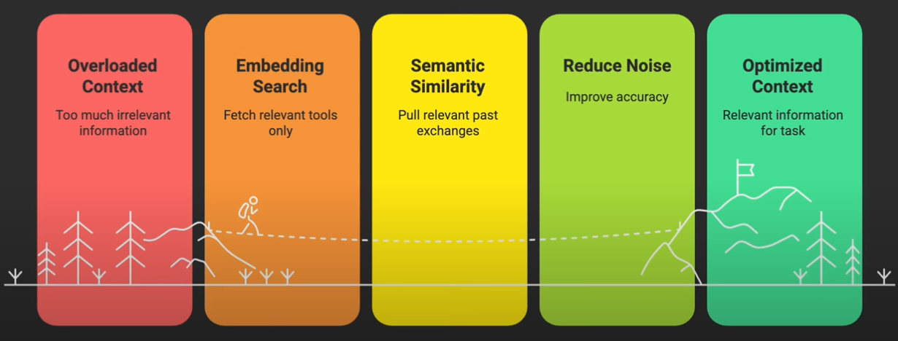
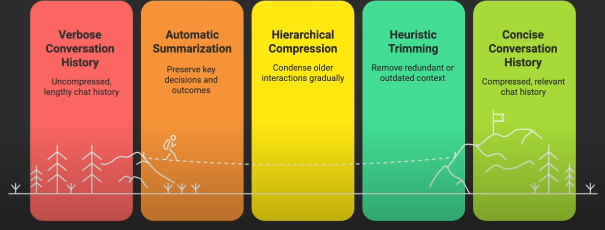
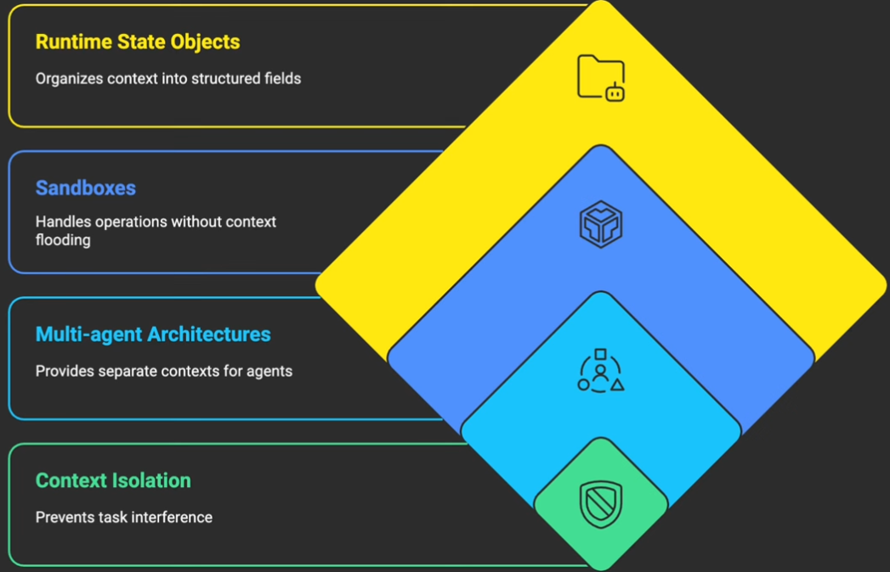
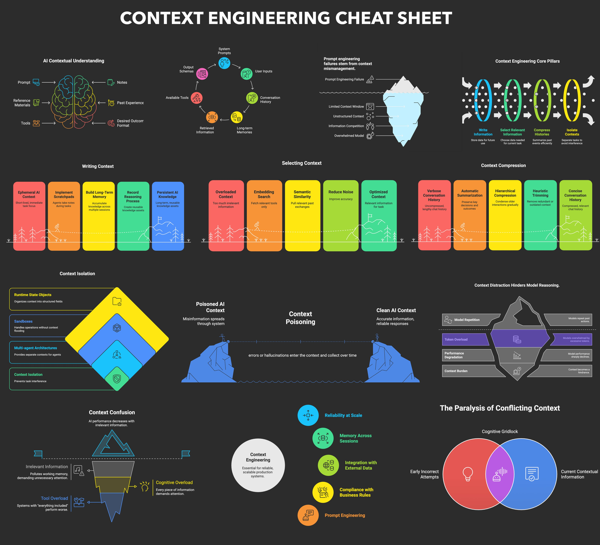

# Context Engineering for Agents

### What is Context Engineering?

Agents need context (instructions, external knowledge, tools) to perform tasks.

> **Context engineering** is building dynamic systems to provide the right information and tools in the right format such that the LLM can plausibly accomplish the task.

> **Context engineering** is the art and science of filling the context window with just the right information at each step of an agent’s trajectory.

> **Context engineering** is the art of providing all the context for the task to be plausibly solvable by the LLM.

> In **Context engineering** LLM is the CPU and the context window is the RAM

Common strategies

- *Writing context - saving it outside the context window to help an agent perform a task.*
- *Selecting context - pulling it into the context window to help an agent perform a task.*
- *Compressing context - retaining only the tokens required to perform a task.*
- *Isolating context - splitting it up to help an agent perform a task.*

In a nutshell, Context Engineering is

- System where the information is collected from different sources
- Is dynamic in nature
- Need the right information (Garbage in, Garbage out)
- Need the right tools
- Format of the data that we provide and the expected outcome
- Can the agent accomplish the task?


### Key constituents of Agent Context



- *System prompts* : System prompts establish persistent behavioral rules that apply across all interactions.  
- *User prompts* : User inputs provide the immediate task or question.
- *Conversation History* : Conversation history maintains continuity within a session.
- *Long-term memories* : Long-term memories preserve knowledge across multiple sessions, including user preferences and past decisions.
- *Retrieved information* : Retrieved information brings in external knowledge from documents, databases, or APIs.
- *Available Tools* : Available tools define what actions the AI can take beyond text generation.
- *Output Schemas* : Output schemas structure how responses should be formatted.


### Why is Context Engineering important?

Context is a very critical aspect of any business. Most of the companies developed AI agents for chatbot applications. Only a fraction of those succeeded in Production. The following are the possible reasons.

- The LLMs messed up (Hallucination)
- The LLM was not provided with the right context to succeed

More often than not (especially as the models get better) model mistakes are caused more by the second reason. The context passed to the model may be bad for a few reasons:

- There is just missing context that the model would need to make the right decision. Models are not mind readers. If you do not give them the right context, they won’t know it exists.
- The context is formatted poorly. Just like humans, communication is important! How you format data when passing into a model absolutely affects how it responds

Let's take an example prompt

```
Role: You are a customer service agent
Task/Instruction: Check refund eligibility based on - purchase within 30 days, unused product, original packaging
Rules: For electronics, warranty status matters. For clothing, check return window extensions
Task/Instruction: Calculate refund amount including taxes but excluding shipping
Format: Format response professionally
```

What are the possible reasons for failure?



The key insight here is that context isn't just about what information exists. It's about what information is accessible when it's accessible, and how it's organized. Effective context provides exactly what's needed for the current task.

The below picture highlights the importance of Context Engineering.




### What is difference between Prompt Engineering and Context Engineering?

[Context Engineering Visual](excalidraw/context-engineering.excalidraw)

|Prompt Engineering     | Context Engineering   |
|-----------------------|-----------------------|
|Explaining to someone what to do. | Knowing what information to offer and how to offer it to ensure that they actually hear and understand what you need. |
|Imagine briefing someone for a critical mission. You give them a 50-page manual like prompt engineering. | You could carefully curate exactly what they need to know at each stage of the mission. provide the maps when they need navigation, technical specs that they need to prepare equipment and historical context when they need to make decisions. That would be context engineering. | 

The goal is ensuring the LLM context is filled only with the right information. Nothing more that would distract and nothing less that would leave gaps. 

> Context Engineering is the next phase of Prompt Engineering

### 4 pillars of Context Engineering

The following are the 4 pillars to provide the right context to the agents.

- Write Information : write information outside of the context window for later retrieval.
- Select Relevant Information : select only relevant information for each specific step.
- Compress Histories : Compress long histories into efficient summaries.
- Isolate Contexts : isolate different contexts to prevent interference between tasks.

## Context Failure Modes

Understanding how context fails is important because it's often a default outcome without proper engineering. Let me show you the four ways context breaks and why each one can destroy AI reliability.

### Context Poisoning
Context poisoning happens when errors or hallucinations enter the context and collect over time.Imagine an AI customer service agent that misunderstands a product feature. That misunderstanding gets saved into memory, referenced in future conversations, and spreads like a virus through the system.

### Context Distraction

Context distraction happens when too much historical information overwhelms the model's ability to reason. Research shows that models beyond 100,000 tokens start repeating past actions instead of generating new solutions. Even smaller models hit that ceiling. 

### Context Confusion

Context confusion happens when irrelevant information pollutes the working memory. Reducing available tools improves success rates dramatically. Even when all the tools fit comfortably in the context window, every piece of information demands attention, even if it's completely irrelevant to the current task. This is why systems with everything included perform worse than the focused ones. 

### Context Clash

Context clash is probably the most subtle when different parts of the context contradict each other.Microsoft and Salesforce documented a 39% performance drop when information accumulated gradually versus being provided all at once. Early incorrect attempts remain in the context and influence final answers. The AI argues with itself and is paralyzed by conflicting information.

So all of these failures add up and context poisoning creates confusion. Confusion leads to distraction. Distraction causes more errors that poison future context.


## Pillars for Context Engineering

### Writing Context

- Writing context means creating persistent storage outside the immediate context window. Think of scratch pads where agents take notes during complex tasks, saving plans and intermediate results for later reference.
- Long-term memories persist across sessions and accumulate knowledge about user preferences, past decisions, and learned patterns.
- When an agent analyzes a complex problem, it writes its reasoning process to memory, creating a reusable knowledge asset rather than losing that work when the context clears. The intuition here
is simple. Just as you wouldn't solve a complex problem without taking notes, AI shouldn't do that either. 

### Selecting Context


- Selecting context involves intelligent retrieval of only what's relevant for the current step. Instead of loading every possible tool, you use embedding search to fetch only the ones needed for that specific task. 
- Rather than including the entire conversation history, you pull relevant past exchanges based on semantic similarity. This prevents context overload where irrelevant information drowns out what actually matters. 
- Smart selection can improve accuracy almost three times simply by reducing noise. Think of it like preparing for a specific meeting. So you don't bring every document that you've ever created. You only bring what's relevant for
today's agenda.


### Context Compression


- Compressing context maintains the benefits of long histories without the token cost as conversations grow.
- Automatic summarization preserves key decisions and outcomes while removing verbose exchanges.
- Hierarchical compression keeps recent interactions detailed while older ones become increasingly condensed.
- You can also trim using horistics, removing redundant information or outdated context that no longer applies.
- The intuition is like taking meeting minutes. You capture the essential decisions and action items, not every word spoken.

### Context Isolation


- Isolating context prevents different tasks from interfering with each other. Multi-agent architectures give each sub agent its own context window and specialized tools. 
- Sandboxes handle specific operations without flooding the main context with intermediate results. 
- Runtime state objects organize different types of context into structured fields and make it easy to access exactly what's needed without searching through unstructured text. 
- You can think of it like having separate workspaces for different projects. Your financial analysis doesn't get mixed up with your creative writing because they exist in isolated contexts.

## Tools
The right tools make the difference between context engineering theory and practice. But the key is that context engineering requires a stack, not just a tool. So let's explore a few frameworks that teams use to build reliable AI systems.

- DSPy (https://dspy.ai/#__tabbed_1_1) for declarative AI programming
- LangGraph (https://www.langchain.com/langgraph) for control structures
- Pinecone, Chroma etc.(Vector databases) for vector embedding storage and search
- Mem0, Memory bank from Google Vertex AI (Memory systems) 


## Conclusion

- Context engineering becomes essential when you need reliability at scale. Production systems serving multiple
users, workflows requiring memory across sessions, integration with external data sources, and compliance with specific business rules all demand proper context management. 
- Context engineering provides the foundation memory retrieval state management and prompt engineering optimizes specific interactions within that foundation and together they create systems that are both reliable and
flexible, creative and consistent. So here is an action plan to follow.
- Remember the core intuition. 
- Context engineering ensures that LLM's working memory contains exactly the right information at the right time. We're not just telling the AI what to do. We're creating an environment where it can't help but understand correctly because irrelevant information never enters the picture. 
- Start by identifying where prompt engineering is failing you. Look for inconsistency between responses,
forgotten information from earlier conversations, confusion when handling multiple requirements, and inability to
learn from past interactions.
- These pain points indicate where context engineering will provide the most value. 
    - Begin with high impact system. 
    - Choose something with clear success metrics where consistency matters. 
    - Implement basic memory first, just the ability to save and retrieve information across sessions.
    - Add retrieval for relevant documents or past decisions. 
    - Introduce compression only when context window becomes a limitation. 
    - And isolate context when different domains start interfering with each other. 
    - Then measure the impact rigorously. 
    - Track accuracy improvements, consistency scores, and user satisfaction.
    - Document how much time you save by not repeatedly explaining context. 
    - Calculate the reduction in errors from forgotten information. 
    - These metrics justify expanding context engineering to other systems.

## Cheatsheet




## References

- [Context Engineering Guide](https://www.promptingguide.ai/guides/context-engineering-guide)
- [Context Engineering for Agents](https://mirror-feeling-d80.notion.site/Context-Engineering-for-Agents-21f808527b17802db4b1c84a068a0976)
- [The rise of Context Engineering](https://blog.langchain.com/the-rise-of-context-engineering/)
- [Context Engineering Cheatsheet](https://x.com/lenadroid/status/1943685060785524824/photo/1)
- [How long context fails?](https://www.dbreunig.com/2025/06/22/how-contexts-fail-and-how-to-fix-them.html)

