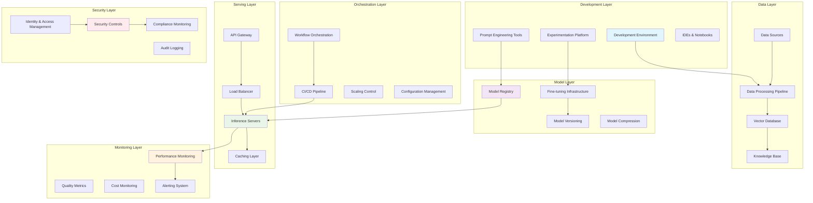
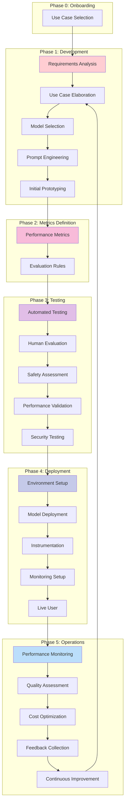

**Version:** 0.1-DRAFT

**Last Updated:** 08-Jun-2025

**Owner(s):** Ganeshji Marwaha

**Contributor(s):** Madhu Venkataraman

---
## Table of Contents

1. [Executive Summary](#executive-summary)
2. [Introduction to LLMOps](#introduction-to-llmops)
3. [Guiding Principles](#guiding-principles)
4. [LLMOps Architecture](#llmops-architecture)
5. [Core Components](#core-components)
6. [LLMOps Lifecycle](#llmops-lifecycle)
7. [Implementation Framework](#implementation-framework)
8. [Best Practices](#best-practices)
9. [LLMOps Maturity Model](#llmops-maturity-model)
10. [Tools](#tools)
11. [Reference Links](#reference-links)

---

## Executive Summary
LLMOps is primarily focused on lifecycle management, development, deployment and governance of LLM's in PRODUCTION environments. This document provides a comprehensive framework for implementing LLMOps practices, addressing the distinct requirements of LLM workflows including prompt engineering, fine-tuning, evaluation, and deployment at scale.

## Introduction to LLMOps
Similar to any IT operations, its a set of tools, guidelines, practices that drive the development, deployment, monitoring and continuous improvement of applications powered by LLM's.

### Key Challenges

- How to scale?
- How to manage hallucinations?
- How to measure and optimize the cost model?
- How to optimize the prompts?
- How to evaulate the model in terms of performance and accuracy?
- What kind of guardrails should be put in place?
- How to make it more predictable with a right set of feedback loop?

## Guiding Principles

- **Security and Privacy:** Prevent unauthorized access and sensitive information leak
- **Compliance:** Adhere to the legal, regulatory and internal organization policies and procedures
- **Reliabile and Robust:** Perform tasks in a more consistent fashion and predicatable. Robust error handling and resilient to unexpected or malicious inputs 
- **Efficient and Scalable:** Cost effective and able to scale on demand
- **Responsible and Ethical:** Unbiased and fair responses aligned with Organization procedures
- **Observable and Auditable:** E2E traceability and audit information available at every step
- **With Human Oversight:** Human intervention or escalation for sensitive tasks
- **Continuous feedback:** Continuous learning, improvement based on the feedback loop

## LLMOps Architecture

## Core components

### 1. Prompt Management

**Prompt Versioning**
- Version control for prompt templates
- A/B testing frameworks for prompt variations
- Prompt performance tracking
- Rollback capabilities

**Prompt Engineering Tools**
- Template management systems
- Few-shot example libraries
- Prompt optimization algorithms
- Chain-of-thought prompt builders

### 2. Model Management

**Model Lifecycle Management**
- Base model selection and evaluation
- Fine-tuning workflow orchestration
- Model compression and quantization
- Multi-model serving strategies

**Version Control**
- Git-based model versioning
- Model artifact tracking
- Dependency management
- Reproducibility frameworks

### 3. Data Management

**Training Data Pipeline**
- Data ingestion and preprocessing
- Data quality validation
- Privacy and compliance checks
- Synthetic data generation

**Knowledge Base Management**
- Vector database integration
- Document embedding pipelines
- Knowledge graph construction
- Real-time data synchronization

### 4. Evaluation Framework

**Automated Testing**
- Unit tests for prompt variations
- Integration testing for end-to-end workflows
- Performance regression testing
- Safety and bias evaluation

**Human Evaluation**
- Human-in-the-loop validation
- Expert review processes
- Crowd-sourced evaluation
- Feedback collection systems

### 5. Deployment and Serving

**Inference Optimization**
- Model quantization and pruning
- Caching strategies
- Batch processing optimization
- Hardware acceleration

**Scalability Solutions**
- Auto-scaling policies
- Load balancing algorithms
- Multi-region deployment
- Edge computing integration

## LLMOps Lifecycle

### Onboarding

### Develop and Experiment
**Objectives:**
- Rapid prototyping of LLM applications
- Prompt engineering and optimization
- Model selection and comparison
- Initial performance validation

**Key Activities:**
- Requirements gathering and use case definition
- Base model evaluation and selection
- Prompt engineering and iteration
- Initial performance benchmarking
- Proof of concept development

**Deliverables:**
- Validated use case specification
- Optimized prompt templates
- Performance baseline metrics
- Technical feasibility assessment

### Test & Evaluate
**Objectives:**
- Comprehensive model testing
- Safety and bias assessment
- Performance validation
- User acceptance testing

**Key Activities:**
- Automated testing suite execution
- Human evaluation coordination
- Safety and alignment testing
- Load testing and performance validation
- Security vulnerability assessment

**Deliverables:**
- Test results and validation reports
- Safety assessment documentation
- Performance benchmarks
- User acceptance criteria validation

### Safety Guidelines

### Deploy and Operate
**Objectives:**
- Production deployment
- System integration
- Monitoring setup
- User onboarding

**Key Activities:**
- Production environment preparation
- Model deployment and configuration
- API integration and testing
- Monitoring system setup
- User training and documentation

**Deliverables:**
- Production-ready deployment
- Integration documentation
- Monitoring dashboards
- User training materials

### Govern
**Objectives:**
- Continuous performance monitoring
- Issue detection and resolution
- Model drift detection
- Continuous improvement

**Key Activities:**
- Performance metrics monitoring
- Quality degradation detection
- Cost optimization analysis
- User feedback collection and analysis
- Model updates and retraining

**Deliverables:**
- Monitoring reports and dashboards
- Performance trend analysis
- Maintenance schedules
- Improvement recommendations

## Implementation Framework

### Development

Refer [Tools](#tools) section for the organization approved tools and frameworks

### Governance

**Model Governance:**
- Model approval workflows
- Version control policies
- Performance thresholds
- Rollback procedures

**Data Governance:**
- Data quality standards
- Privacy compliance measures
- Access control policies
- Audit trail requirements

**Operational Governance:**
- Change management processes
- Incident response procedures
- Cost management policies
- Performance SLAs

### Security

**Model Security:**
- Prompt injection prevention
- Model extraction protection
- Adversarial attack mitigation
- ACL

**Data Security:**
- Encryption at rest and in transit
- PII detection and handling
- Data anonymization techniques
- Secure data transmission

**Infrastructure Security:**
- Network security controls
- Container security scanning
- Secrets management
- Vulnerability assessments

### Compliance

**Regulatory Compliance:**
- GDPR and data protection
- Industry-specific regulations
- AI governance requirements
- Audit trail maintenance

**Ethical AI Considerations:**
- Bias detection and mitigation
- Fairness assessment
- Transparency requirements
- Responsible AI practices

### Monitoring & Observability

**Performance Metrics:**
- Latency and throughput
- Token generation speed
- Context window utilization
- Cache hit rates

**Quality Metrics:**
- Response relevance scores
- Factual accuracy rates
- Coherence measurements
- Safety violation detection

**Cost Metrics:**
- Inference cost per request
- Infrastructure utilization
- ROI measurements

**Operational Metrics:**
- System availability
- Error rates
- Scaling events
- Resource consumption

## Best Practices

### Development

- Provide examples in your prompts
- Provide requirements in markdown
- Design simple, consise and clear prompts
- Be specific about the output format
- Use instructions over constraints
- Control the max token length
- Use JSON while understanding its drawback

### The lethal trifacta

- Private data : Tools access
- Untrusted content : Malicious text or content controlled by an attacker becomes available to the LLM
- External communication : Data theft (Exfiltration)

#### Design patterns for Securing LLMs against Prompt Injection

- Action-Selection Pattern

- The Plan-Then-Execute Pattern

- The LLM Map-Reduce Pattern

- The Code-Then-Execute Pattern

- The Dual LLM Pattern

- The Context-Minimization Pattern

## LLMOps Maturity Model

The Maturity model is based on the following dimensions

- Data Preparation - Data sources for RAG, fine-tuning and evaluation
- Prompt Engineering - Prompt development and versioning
- Model development & Customization - Model selection, fine-tuning
- Testing and Evaluation - Test stragegy and validation process
- Deployment - Packaging and deployment
- Monitoring & Observability - Tracing, performance, cost, drift and feedback loop 
- Governance & Reponsible AI - Security and Regulatory compliance aligning with Organization goals
- Workflow - Orchestration of agents
- Cost - Tracking the operational expenses
- Tools and Infrastructure - The toolchain that drives LLMOps

**Phase 0 - Experimental**

**Phase 1 - Foundational**

**Phase 2 - Managed**

**Phase 3 - Optimized**

**Phase 4 - Innovation**

## Tools

| Function          | Tools / Frameworks                         |
| ----------------- | ------------------------------------------ |
| Models            | Open AI : gpt-4o, gpt-4.1, o3, o4-mini |
|                   | Gemini : gemini2.5-pro, gemini2.5-flash, Imagen, Veo |
|                   | Anthropic: Sonnet 4 |
| Embedding Models  | Llama 3.3 70B Instruct Turbo  |
| Reranker          | Cohere, llama 3   |
| Prompt Management | PromptLayer |
| Prompt Optimization | DSPy    |
| Orchestration     | Langchain/LangGraph, LlamaIndex, Semantic Kernel, CrewAI|
| Evaluation        | Arize, FiddlerAI, Giskard, Ragas, Deepeval, Phoenix (Open Source) |
| Multi-model eval  | Gecko |
| Monitoring        | LangSmith, Arize, WhyLabs, Langfuse, MLFlow|
| Vector DBs        | PineCone, Chroma, FAISS, QDrant  |
| Governance        | Credo AI|
| Deployment        | LangServe, Hugging Face Inference, VLLM, Ray, Modal |
| Security          | NVIDIA NeMo Guardrails  |
| Fine tuning       |  |
| Memory            | Mem0  |

## Reference Links
- https://cookbook.openai.com/examples/partners/model_selection_guide/model_selection_guide#prototype-to-production
- https://cookbook.openai.com/examples/gpt4-1_prompting_guide
- https://www.anthropic.com/engineering/building-effective-agents
- https://modelcontextprotocol.io/introduction
- https://www.promptingguide.ai/

## Glossary

|Key Term                   |   Explanation                 |
|---------------------------|-------------------------------|
|GenAI Application          |A fully baked GenAI workflow including governance, logging, monitoring, data/context interactions, prompting, use of prompting techniques |
|GenAI Workflow             |A workflow that solves a business problem using one or more LLMs or ther generative models. It includes business logic as well |
|Foundation Model           |A deep neural network trained on a broad set of generalized and unlabeled data and capable of performing a wide variety of general tasks across different modalities |
|Large Language Model       |A model used in natural language processing which may have anywhere from hundreds to trillions of parameters. LLMs are foundation models |
|Prompt                     |The text provided to an LLM or multi-modal Foundation model to aid an output generation. It can include instructions, context, examples and user input. |
|Prompt Template            |A structured prompt with placeholders acting as template |
|Prompt Generation          |The dynamic generation of instructions and an LLM specific prompt template, given a set of prompting strategies specified by the user |
|Instructions               |A portion of the prompt which tells the model what it should be doing. e.g., role, input, output structure etc. |
|Context                    |Additional information provided to the prompt that helps the model address the user's request |
|Chain                      |Refers to the sequence of calls whether to an LLM or tool. It could a complete workflow |
|Agent                      |Can take actions autonomously, has long-term or short-term memory and can invoke tools |
|Tool                       |A capability provided to an agent which allows it to take an action. A function call or API |
|Memory                     |A provision to store conversational context |
|Guardrail                  |Protection mechanism provided to an input or output of an LLM to ensure safety and appropriateness |
|Embedding Model            |A ML model that takes an input (structure or unstructured) and returns a multi-dimensional vector that represents the semantic content of data |
|RAG                        |Improves the output of an LLM by using an external data store to provide more context to answer the query  |
|Similarity Search          |The process of using an embedding model and vector database to find semantically similar content |
|Vector database            |A type of database to store high dimensional vector |
|MCP                        |A standard that bridges the gap between agents and external platforms. With MCP, GenAI agents can dynamically interact with enterprise systems |
|MCP Server                 |   |
|MCP Client                 |   |
|Parameter-efficient Fine Tuning (PEFT)|    |
|Time To First Token (TTFT) |   |
|Hypothetical Document Embedding (HyDE) |   |
|Recursive Abstractive Processing for Tree Organized Retreival (RAPTOR) |   |
|Corrective RAG (CRAG)  |   |
