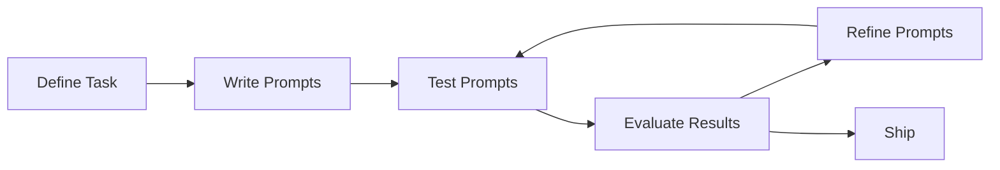

# Prompt Engineering

## What is Prompt Engineering

Let's take a step back and look at how an LLM works; it's more of a prediction engine. The model takes sequential text as an input and then predicts what the following token should be, based on the data it was trained on. Prompt engineering is the process of designing high-quality prompts that guide LLMs to produce accurate outputs. This process involves tinkering to find the best prompt, optimizing prompt length, and evaluating a prompt’s writing style and structure in relation to the task.

Prompt engineering is a discipline in AI SDLC for developing and optimizing prompts to efficiently apply and build with large language models (LLMs). Prompt engineering skills help to better understand the capabilities and limitations of LLMs. Researchers use prompt engineering to improve safety and the capacity of LLMs on a wide range of common and complex tasks such as question answering and arithmetic reasoning. Developers use prompt engineering to design robust and effective prompting techniques that interface with LLMs and other tools.

## Structure of the Prompt

A prompt contains any of the following elements:

- Instruction - a specific task or instruction you want the model to perform
- Context - external information or additional context that can steer the model to better responses
- Input Data - the input or question that we are interested to find a response for

There are also several optional components you can use in your prompts:

- Persona : Who or what the model is acting as.
- Constraints : Restrictions on what the model must adhere to when generating a response, including what the model can and can't do.
- Tone : The tone of the response. You can also influence the style and tone by specifying a persona.
- Examples : Examples of how the response should look for a given prompt. This prompt shows an example of correct formatting to the model. 
- Reasoning steps : Tell the model to explain its reasoning. This can sometimes improve the model's reasoning capability.
- Response format : The format that you want the response to be in. For example, you can tell the model to output the response in JSON, table, Markdown, paragraph, bulleted list, keywords, elevator pitch, and so on.
- Recap : Concise repeat of the key points of the prompt, especially the constraints and response format, at the end of the prompt.
- Safeguards : Grounds the questions to the mission of the bot.
- Input : Dynamic input from the user. For applications, this is filled in at runtime.
- Prefilled response : The beginning of the response, prefilled to help the model fill in the response.

Types of Messages

- System Message :  Instructions or context provided to the AI system, guiding its behavior and setting its personality, tone, or response format within a conversation.
- User Message : An input from a human user to an AI assistant, typically a request, question, or comment.
- Assistant Message : A response generated by the AI assistant to the user, intended to fulfill the user's request or answer their question.
- Tool Message : Appears in function calling scenarios to format the output of a tool invoked by the AI for the user. 

## Prompt Templates

## Prompting Techniques

LLMs are tuned to follow instructions and are trained on large amounts of data so they can understand a prompt and generate an answer. But LLMs aren’t perfect; the clearer your prompt text, the better it is for the LLM to predict the next likely text. Additionally, specific techniques that take advantage of how LLMs are trained and how LLMs work will help you get the relevant results from LLMs.

1. Zero shot Prompting

2. One or few shot Prompting

3. Chain of Thought (CoT)

4. Tree of Thought (ToT)

5. ReAct (Reasoning and Acting)
The AI reasons about a problem, takes an action (potentially using a tool), observes the result, and then uses that observation to refine its reasoning and subsequent action in a cycle. ReAct is like an improviser, figuring things out as it goes.

6. ReWOO (Reasoning Without Observation)
The AI plans its actions upfront, anticipates the necessary tools, and executes the plan. It doesn't necessarily need to observe the results of each step before planning the next. ReWOO is like a strategist, planning everything in advance. 

## Best Practices

- Provide Examples

- Design with Simplicity

- Be specific about the output

- Use instructions over Constraints

- Control the max token length

- Use variables in prompts

- Experiment with input formats and writing styles

- Adapt to model updates

- Experiment with output formats

## Tips and Tricks

- Keep instructions simple
- Give clear and specific instructions
- Adopt a persona
- Verify safety filters
- Experiment with temparature
- Use fewer examples with variety and diversity
- Limit negative examples and instructions
- Structure your context
- Instruct the model to explain its reasoning
- Use XML prompt separators

## Prompt Engineering Workflow

Prompt engineering is a test-driven and iterative process that can enhance model performance.

## Modes of Prompting - XML, JSON, YAML and Markdown

Prompting large language models (LLMs) can be enhanced by using structured data formats like JSON, XML, YAML, and Markdown. Each format offers distinct advantages for different use cases.

### JSON (JavaScript Object Notation):
#### Strengths:
Excellent for complex, hierarchical data, easily machine-readable and machine-generatable. Reduces ambiguity and errors in AI responses, often leading to lower hallucinations.
#### Use Cases:
Providing structured input like detailed configurations, lists of items with properties, or expecting structured output from the model.
### XML (Extensible Markup Language):
#### Strengths:
Highly structured, widely adopted for data exchange, offers clear separation of data elements using tags. Can improve clarity and parsability, especially with smaller models.
#### Use Cases:
Structuring complex prompts with distinct sections or components, providing context with clear delimiters, or when interoperability with existing XML-based systems is required.
### YAML (YAML Ain't Markup Language):
#### Strengths:
Human-readable and editable, yet still machine-parseable. Good for configuration-like prompts and offers better token efficiency than XML or JSON in some scenarios.
#### Use Cases:
Storing prompt templates or components (e.g., system messages, hints, user questions), managing prompt content as structured data, or when a balance between structure and readability is desired.
### Markdown:
#### Strengths:
Simple, human-readable, and easy to write. Excellent for adding formatting and structure to text, improving readability for both humans and LLMs.
#### Use Cases:
Structuring prompts into easily digestible sections, highlighting key information using headings, lists, or bold text, and formatting the expected output from the AI for better presentation.

### Considerations for Choosing a Format:
Clarity and Structure: XML and JSON provide the most rigid structure, while YAML offers a more human-friendly structured approach, and Markdown focuses on readability and basic formatting.
- Readability: Markdown and YAML are generally more human-readable than JSON and XML.
- Machine Parsability: JSON, XML, and YAML are all designed for machine parsing, while Markdown requires more advanced parsing for extracting structured data.
- Token Efficiency: YAML can sometimes be more token-efficient than other structured formats.
- Model Sensitivity: LLMs can be sensitive to prompt formatting, so experimenting with different formats for specific tasks is recommended.

In practice, a blended approach is often effective, combining Markdown for overall prompt readability with JSON, XML, or YAML within delimited sections for specific structured data or instructions. The ultimate goal is to clearly communicate your prompt's intent and structure to the model.

## Reference Links

- https://docs.anthropic.com/en/docs/build-with-claude/prompt-engineering/use-xml-tags
- https://blog.promptlayer.com/is-json-prompting-a-good-strategy/
- https://mikelev.in/futureproof/ai-prompts-xml-tags/
- https://aws.amazon.com/blogs/machine-learning/prompt-engineering-techniques-and-best-practices-learn-by-doing-with-anthropics-claude-3-on-amazon-bedrock/