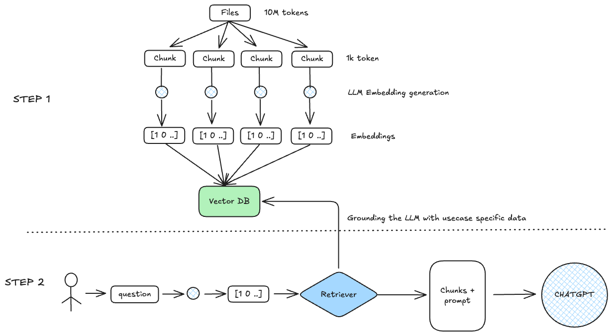

# Retrieval Augmented Generation (RAG)

## What is RAG?
- It is a technique in natural language processing (NLP) that combines retrieval-based methods with generative models to improve the quality and accuracy of generated responses.
- It is a technique for improving the quality of LLM output by grounding it with sources of knowledge not available in the trained model.

### The emergence of RAG : 
RAG has emerged almost at the same time as the LLMs have become mainstream with introduction of ChatGPT at the end of 2022. The Retrieval Augmented Generation technique was brought to life in order to solve for issues that native LLMs faced. In short:

- Hallucinations.
- Limited Context window size.
- Lack of access to non-public data.
- Parametric knowledge limited to the latest data the model was trained on.

### Anatomy of RAG

RAG is an efficient way to provide an Foundation Models with additional knowledge by using external data sources and is depicted in the following diagram:

- Retrieval: Based on a user’s question, relevant information is retrieved from a knowledge base (for example, an OpenSearch index).
- Augmentation: The retrieved information is added to the Foundation Model prompt to augment its knowledge, along with the user query.
- Generation: The Foundation Model generates an answer by using the information provided in the prompt.

NOTE: A RAG is only as good as its RETRIEVER

**Moving pieces of the Naive RAG system**

**Retrieval**
    - Chunking - how do you chunk the data that you will use for external context.
    - Small, Large chunks.
    - Sliding or tumbling window for chunking.
    - Retrieve parent or linked chunks when searching or just use originally retrieved data.
    
Choosing the embedding model to embed and query and external context to/from the latent space. Considering Contextual embeddings.

**Vector Database**
    - Which Database to choose?
    - Where to host?
    - What metadata to store together with embeddings? The data to be used for pre-filtering and post-filtering
    - Indexing strategy?

**Vector Search**
    - Choice of similarity measure.
    - Choosing the query path - metadata first vs. ANN first.
    - Hybrid search.

**Heuristics - business rules applied to your retrieval procedure**
    - Time importance.
    - Duplicate context (diversity ranking).
    - Source retrieval.
    - Conditional document preprocessing.

## RAG use cases

- Customer service– This can include the following:
    - Internal– Live agents use an internal chatbot to help them answer customer questions.
    - External– Customers directly chat with a generative AI chatbot.
    - Hybrid– The model generates smart replies for live agents that they can edit before sending to customers.
- Employee training and resources– In this use case, chatbots can use employee training manuals, HR resources, and IT service documents to help employees onboard faster or find the information they need to troubleshoot internal issues.
- Industrial maintenance– Maintenance manuals for complex machines can have several hundred pages. Building a RAG solution around these manuals helps maintenance technicians find relevant information faster. Note that maintenance manuals often have images and schemas, which could put them in a multimodal bucket.
- Product information search– Field specialists need to identify relevant products for a given use case, or conversely find the right technical information about a given product.
- Retrieving and summarizing financial news– Analysts need the most up-to-date information on markets and the economy and rely on large databases of news or commentary articles. A RAG solution is a way to efficiently retrieve and summarize the relevant information on a given topic.

## Evaluation of RAG solution

Contrary to traditional machine learning (ML) models, for which evaluation metrics are well defined and straightforward to compute, evaluating a RAG framework is still an open problem. 

In our experience, when a RAG system performs poorly, we found the retrieval part to almost always be the culprit. Large pre-trained models such as Anthropic’s Claude model will generate high-quality answers if provided with the right information, and we notice two main failure modes:

- The relevant information isn’t present in the retrieved documents: In this case, the FM can try to make up an answer or use its own knowledge to answer. Adding guardrails against such behavior is essential.
- Relevant information is buried within an excessive amount of irrelevant data: When the scope of the retriever is too broad, the FM can get confused and start mixing up multiple data sources, resulting in a wrong answer. More advanced models such as Anthropic’s Claude Sonnet 3.5 and Opus are reported to be more robust against such behavior, but this is still a risk to be aware of.

To evaluate the quality of the retriever, you can use the following traditional retrieval metrics:

- Top-k accuracy: Measures whether at least one relevant document is found within the top k retrieved documents.
- Mean Reciprocal Rank (MRR)– This metric considers the ranking of the retrieved documents. It’s calculated as the average of the reciprocal ranks (RR) for each query. The RR is the inverse of the rank position of the first relevant document. For example, if the first relevant document is in third 
position, the RR is 1/3. A higher MRR indicates that the retriever can rank the most relevant documents higher.
- Recall– This metric measures the ability of the retriever to retrieve relevant documents from the corpus. It’s calculated as the number of relevant documents that are successfully retrieved over the total number of relevant documents. Higher recall indicates that the retriever can find most of the relevant information.
- Precision– This metric measures the ability of the retriever to retrieve only relevant documents and avoid irrelevant ones. It’s calculated by the number of relevant documents successfully retrieved over the total number of documents retrieved. Higher precision indicates that the retriever isn’t retrieving too many irrelevant documents.

To evaluate the quality of the generated response, two main options are:

- Evaluation by subject matter experts: this provides the highest reliability in terms of evaluation but can’t scale to a large number of questions and slows down iterations on the RAG solution.
- Evaluation by FM (also called LLM-as-a-judge):
  - With a human-created starting point: Provide the FM with a set of ground truth question-and-answer pairs and ask the FM to evaluate the quality of the generated answer by comparing it to the ground truth one.
  - With an FM-generated ground truth: Use an FM to generate question-and-answer pairs for given chunks, and then use this as a ground truth, before resorting to an FM to compare RAG answers to that ground truth.

Evaluation libraries : Ragas, LlamaIndex, RefChecker(AWS)

## Troubleshooting RAG
The following are the potential issues

1. The relevant chunk wasn't retrieved
    - Try increasing the number of documents retrieved by the nearest neighbor search and re-ranking the results
    - Try hybrid search. Using keyword and semantic search
    - Try query rewriting
2. Too many chunks were retrieved
    - Try using keyword matching to restrict search results
    - Try metadata filtering
    - Try query rewriting to get the right metadata filtering
3. A relevant chunk was retrieved, but it's missing some context
    - Try changing the chunking strategy
        - Increase chunk size and overlap
        - Section based chunking
    - Try small to large retrievers
4. If none of the above help
    - Try training a custom embedding
5. The retriever isn't at fault, the problem is with FM generation
    - Try prompt engineering
    - Try another FM to evaluate or correct the answer
    - Try prompting the FM to use quotes in its answers, to allow manual fact checking

### Improving the Retriever

- Hybrid Search
- Adding metadata to the text chunks
- Small-to-Large chunk retrieval
- Section based chunking
- Rewriting user query
- Metadata filtering

### Improving the Reliability of Responses

- Prompt engineering guardrails
- Asking FM to quote outputs
- Generating answers with inline quotations
- Verifying quotes

### RAG on heterogeneous data formats

- Routers to manage diverse data sources
- Handle tabular data
- Multimodal RAG (with image and text)

### RAG - effective chunking strategies

Effective chunking strategies in AI, particularly within Retrieval-Augmented Generation (RAG) systems, involve dividing large documents into manageable segments while preserving meaning and context. This optimization is crucial for efficient information retrieval and better model performance. Key strategies include fixed-size chunking, recursive chunking, semantic chunking, and document-based chunking. 

Here's a breakdown of effective chunking strategies:
1. Fixed-Size Chunking:
    This method splits text into uniform chunks based on a predefined character count. It's simple to implement but may cut off sentences or logical 
    units. 
2. Recursive Chunking:
     This approach recursively divides text based on structural elements like paragraphs, sentences, and words, aiming to preserve context at different 
      levels. 
3. Semantic Chunking:
    This method considers the semantic similarity of text chunks, grouping sentences with similar meaning to form meaningful units. 
4. Document-Based Chunking:
    This approach leverages document structure, such as headings, sections, and other elements, to define chunks. 
5. Sliding Window Chunking:
    This technique overlaps chunks to prevent losing critical information at chunk boundaries, particularly useful in tasks requiring seamless transitions. 
6. Metadata-Enhanced Chunking:
    Adding metadata to chunks, such as document source, section headings, or relevant keywords, can improve retrieval accuracy. 
7. Content-Aware Splitting:
    This strategy focuses on the content type of the document, ensuring that chunks maintain the integrity of different content types like Markdown, 
    LaTeX, or HTML. 
8. Agentic Chunking:
    This approach utilizes LLMs to determine appropriate chunk boundaries based on semantic meaning and document structure, mimicking human 
    reasoning. 

Factors to consider when choosing a chunking strategy:
- Chunk Size:
    Smaller chunks can improve retrieval precision but might lose context, while larger chunks can encompass more information but may dilute relevance. 
- Chunk Overlap:
    Overlap helps maintain context across chunk boundaries, particularly important for tasks like dialogue generation or summarization. 
- Model Capacity:
    The chunk size should align with the capacity of the RAG model. Smaller models might struggle with large chunks, while larger models can handle them 
    more effectively. 
- Task Requirements:
    Different tasks, such as question-answering or summarization, may benefit from different chunking strategies. 
- Knowledge Base Size:
    Larger knowledge bases might benefit from smaller chunks to reduce the risk of irrelevant information retrieval. 
- Latency and Speed:
    Real-time applications require chunking strategies that minimize retrieval time

### Challenges with Traditional RAG

- Context deficiency with long documents
    - Chunking long documents disrupts information flow
    - Concepts spread across chunks might be overlooked leading to 
      inaccurate or incomplete responses
- Flat retrieval structure
    - Doesn't recognize that important information could be buried 
      deep within the documents
- Limited reasoning and fact checking
    - Limited ability to reason over the information (or) perform 
      robust fact-checking
- Bias and fairness
    - The quality and the bias inherent in the retrieved documents 
      can be reflected in the RAG output
- Interpretability and explainability
    - Understanding how is difficult

## RAG Architectures

- **Naive RAG**

- **Retrieve and Re-rank**

- **Multimodal RAG**

- **Hybrid RAG**

- **Graph RAG**

- **Agentic RAG (Router)**

- **Agentic RAG (Multi-agent RAG)**

## Advanced RAG Techniques

### Pre-retrieval optimization

1. **Query Transformation**
Modifies or expands the original query to improve retrieval accuracy (e.g., query rewriting, paraphrasing).

2. **HyDE Retrieval (Hypothetical Document Embeddings)**
Generates hypothetical answers from the LLM and embeds them to retrieve supporting documents.

3. **Basic Index Retrieval + Metadata:**
Uses traditional vector search enhanced with metadata filters (e.g., tags, source).

4. **RAPTOR (Recursive Abstractive Processing for Tree Organized Retreival)** - Employs a recursive process of summarizing, embedding and clustering documents. This process creates a tree-like structure where leaves represent individual documents, and the nodes represent summaries at increasing levels of abstraction

### Retrieval optimization

5. **Hybrid Search (Fusion Rank)**
Combines keyword search (BM25) with vector search (dense embeddings) using ranking algorithms.

6. **Hierarchical Index Retrieval**
Organizes documents in multi-level indexes (e.g., chapter → section → paragraph) for structured search.

7. **Parent-Child Chunks Retrieval**
Links document chunks to parents (e.g., section headers) to preserve context during retrieval.

8. **Sentence Window Retrieval**
Expands retrieval scope by pulling nearby sentences to add richer context.

9. **Agents + Query Routing**
Employs intelligent agents that interpret the query and route to the right tools or indexes dynamically.

10. **Query Routing**
Routes queries to specialized indexes or retrievers based on query intent or topic.

11. **Reciprocal Rank Fusion (RRF)**
Classic search engine technique to combine multiple ranked search result lists into a single, improved list. You can perform RAG search with multiple algorithms (BM25 + Semantic) and then combine them easily

### Post-retrieval optimization

12. **CRAG (Corrective RAG)** - Enhances the RAG by incorporating a self-correction mechanism that evaluates and refines retrieved knoweledge, significantly reducing errors and improving accuracy.

13. **Knowledge Filtering**
Removing irrelevant or redundant information from the retrieved context before passing it to the generation model. 

14. **Multi-Document Fusion** 
Combining information from multiple retrieved documents to create a more comprehensive and coherent context. 

15. **Response Synthesis** 
Using LLMs to synthesize the final response based on the retrieved context and the original query, potentially involving multiple LLM interactions. 

## Reference links

- [RAG Architectures](https://humanloop.com/blog/rag-architectures)
- [Advanced RAG Techniques](https://medium.com/@yugank.aman/advanced-rag-techniques-0c283aacf5ba)